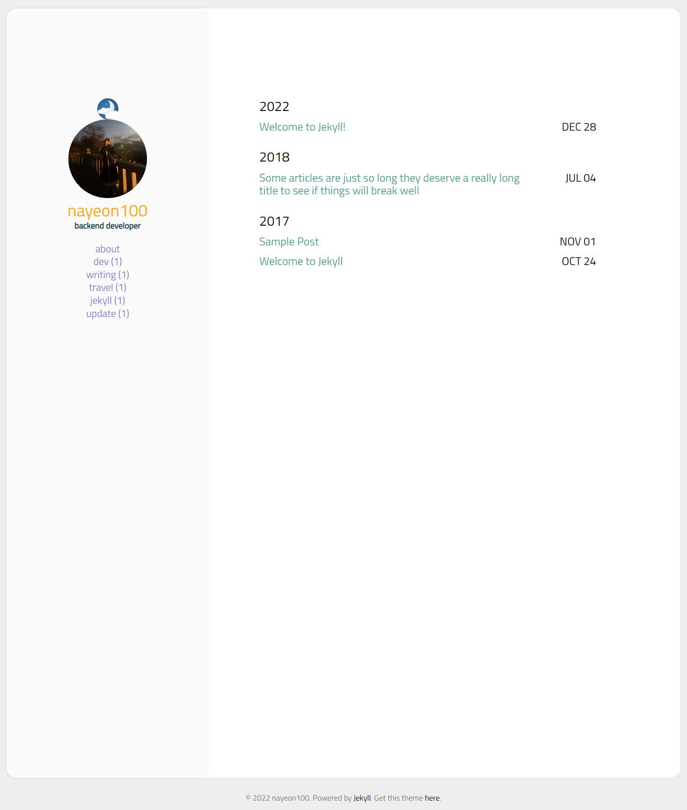
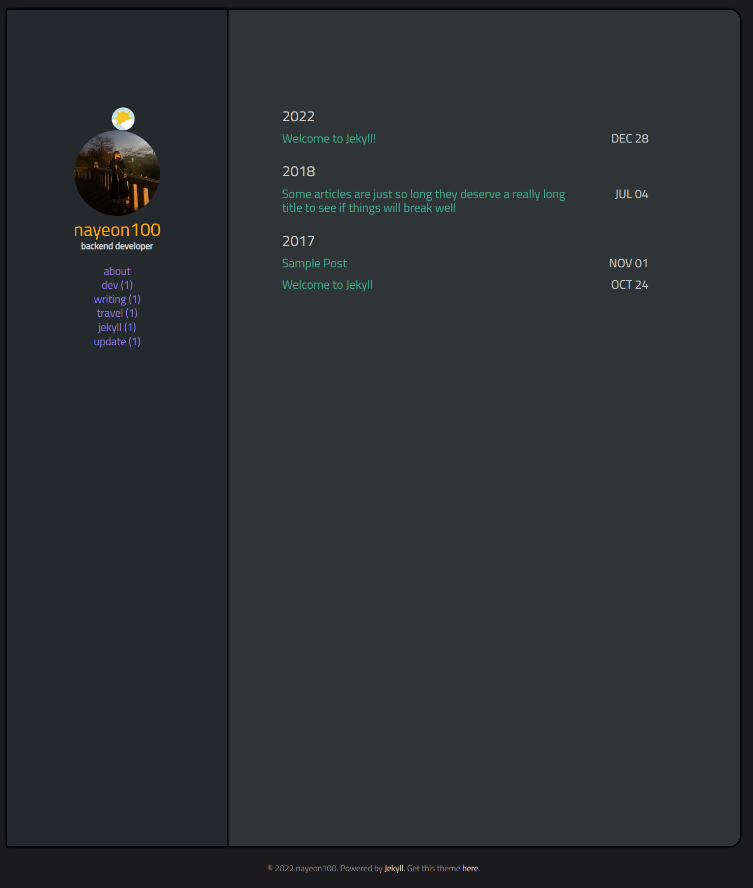

Jekyll을 이용해 간단하게 블로그를 만들었다!  
예전부터 생각만 하다가 여유가 생겨서 드디어 시작한다.  

{: width="45%"}
{: width="45.3%"}


사용한 테마 : [https://github.com/starry99/catbook](https://github.com/starry99/catbook)  
light, dark 모드 전환도 가능해서 취향 저격이다. :relaxed:

#### Jekyll-Admin plugin 설치하기
편하게 글을 올릴 수 있도록 어드민 플러그인을 설치한다.  
프로젝트의 Gemfile에 아래 한 줄만 추가해주면 된다.  
```
gem 'jekyll-admin', group: :jekyll_plugins
```
추가 후 순서대로 install, 재시작 하면 끝이다.
```
bundle install
```
```
jekyll serve
```

재시작 후 아래 링크로 들어가면 어드민이 구성되어있다.~~~
[http://localhost:4000/admin ](http://localhost:4000/admin)

참고:
[https://jetalog.net/87?category=808871](https://jetalog.net/87?category=808871)
[https://labs.brandi.co.kr/2018/07/03/chunbs.html](https://labs.brandi.co.kr/2018/07/03/chunbs.html)
